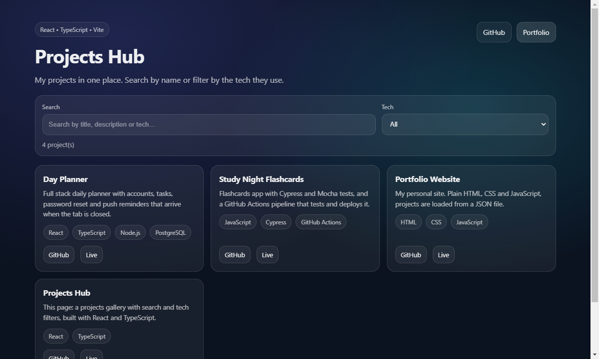

# Projects Hub

[](https://github.com/Soodabug/projects-hub/actions/workflows/ci.yml)

A small gallery of my projects with a search box and a tech filter. I built it to practice React with TypeScript, and later used it to practice testing React components.

Live: https://soodabug.github.io/projects-hub/



## What it does

- Search by title, description or tech. Not case sensitive.
- Filter by tech. The dropdown is built from the data, so a project with a new tech adds a new option by itself.
- The filters are kept in the address, for example `?q=planner&tech=React`, so a filtered view can be sent as a link.
- "Clear filters" when nothing matches.

## How it is built

```
frontend/src/
  data/projects.ts        the typed list of projects
  lib/filterProjects.ts   search and tech filter, plain functions
  lib/urlFilters.ts       reading and writing the filters in the address
  components/ProjectCard.tsx
  App.tsx                 state and layout
```

I moved the filter logic out of the component into plain functions. That keeps `App.tsx` short and lets me test the logic without rendering anything.

## Run it

```bash
cd frontend
npm install
npm run dev
```

## Tests

```bash
npm run lint
npm test          # Vitest + React Testing Library
npm run build     # type-check and build
```

There are 33 tests in four files:

- `lib/filterProjects.test.ts` - search and filter rules
- `lib/urlFilters.test.ts` - filters to address and back
- `App.test.tsx` - the page as a user sees it: typing, selecting, empty state, address bar
- `data/projects.test.ts` - checks the project list itself: unique ids, real repo links, no leftover test values. I added this one after I found a `TEST123` tag on the live page.

GitHub Actions runs lint, tests and build on every push, and publishes to GitHub Pages only if they pass.

## Adding a project

Add an object to the list in `frontend/src/data/projects.ts`:

```ts
{
  id: "my-project",
  title: "My Project",
  description: "One sentence about it.",
  tech: ["React", "TypeScript"],
  repo: "https://github.com/user/repo",
  live: "https://...", // optional
}
```

`npm test` will complain if the id is already used or the repo link is not a real repository link.

## Note

The first commits in the history are a course starter template that this repo was created from. None of it is left; the React app in `frontend/` is mine.
